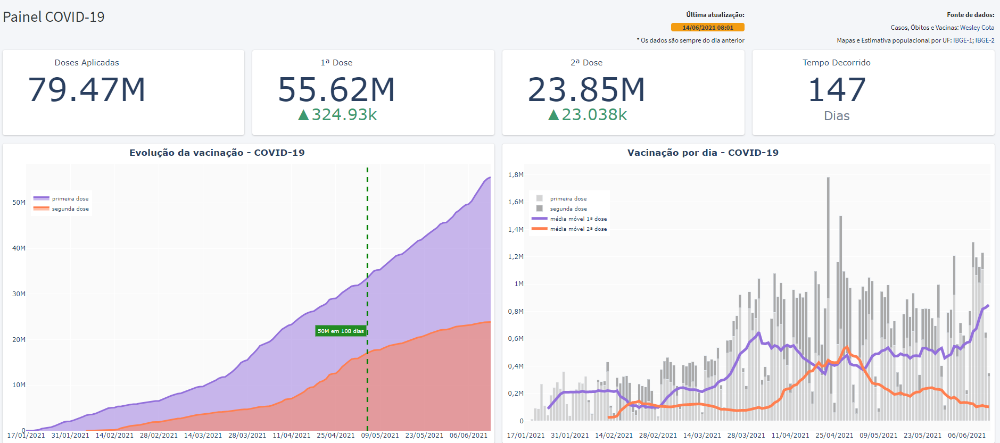
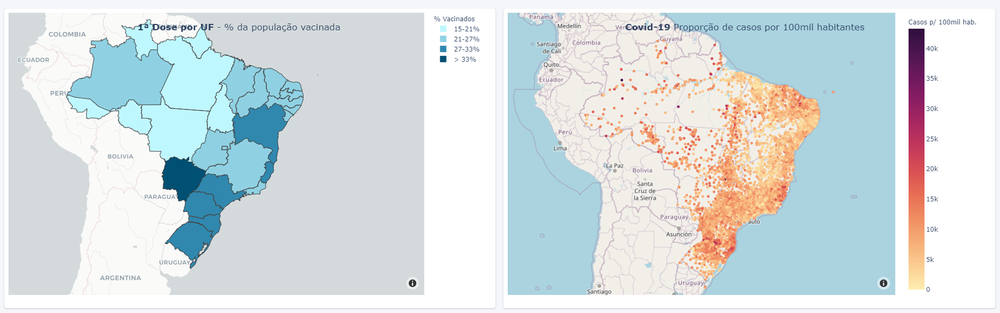
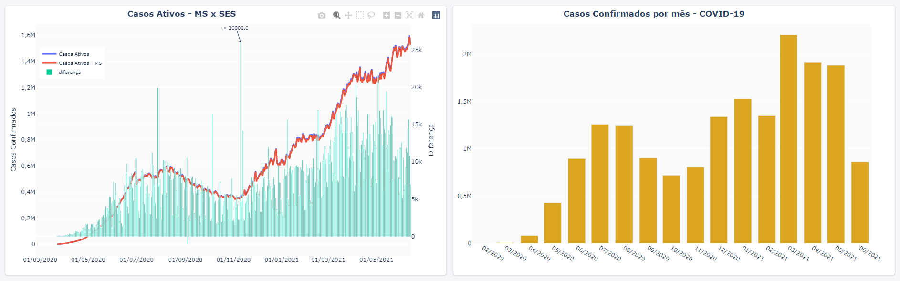
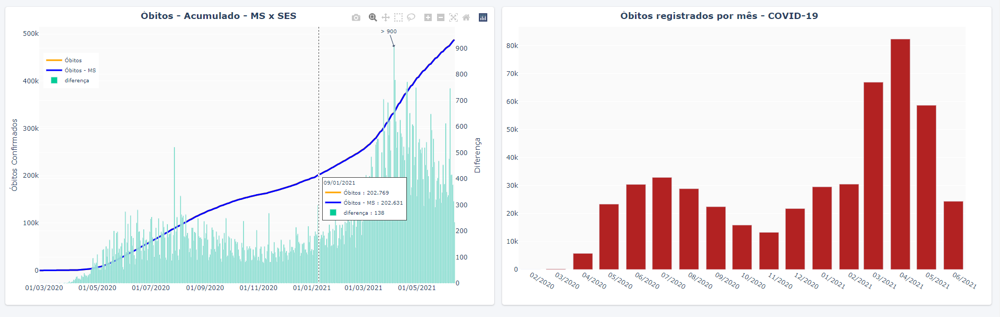

# covid19-brasil
Insights sobre a situação da covid-19 no Brasil.

> Projeto desenvolvido em Python com o uso da biblioteca Plotly para geração de visualizações de indicadores e gráficos sobre a situação de casos, óbitos e vacinação relacionada à Covid-19 no Brasil.

O arquivo **dados-covid19-brasil.ipynb** contém exemplo de código capaz de gerar os gráficos das imagens abaixo.

### Exemplos de dashboard que pode ser criado a partir dos gráficos criados:

